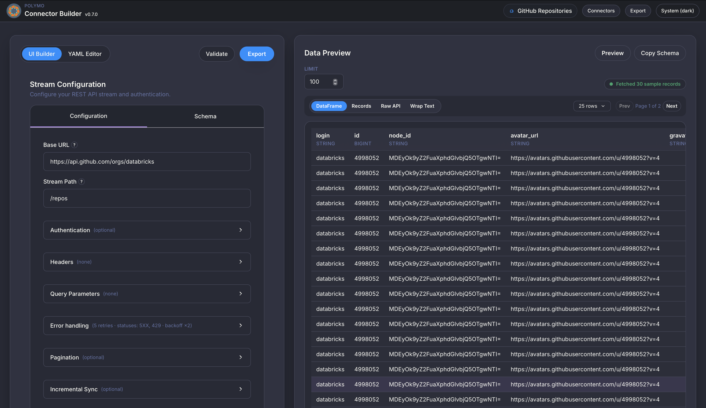

<p align="center">
  
</p>

# Welcome to Polymo

Polymo is a helper for pyspark that turns everyday web APIs into tables you can analyse. Point it at an API, tell it what you want to grab, and Polymo does the heavy lifting of fetching the data and lining it up neatly.

<!-- Centered clickable screenshot -->
<p align="center">
  <a href="docs/ui.png">
    
  </a>
</p>

Once you have defined the config, all you need to do is register the Polymo reader and tell Spark where to find the config:

```python
from pyspark.sql import SparkSession
from polymo import ApiReader

spark = SparkSession.builder.getOrCreate()
spark.dataSource.register(ApiReader)

df = (
    spark.read.format("polymo")
    .option("config_path", "./config.yml")  # YAML you saved from the Builder
    .option("token", "YOUR_TOKEN")  # Only if the API needs one
    .load()
)

df.show()
```

Structured Streaming works out of the box aswell:

```python
stream_df = (
    spark.readStream.format("polymo")
    .option("config_path", "./config.yml")
    .option("stream_batch_size", 100)
    .option("stream_progress_path", "/tmp/polymo-progress.json")
    .load()
)

query = stream_df.writeStream.format("memory").outputMode("append").queryName("polymo")
query.start()
```

Already many features are supported: 
- Authentication helpers covering no auth, bearer tokens, API keys injected as parameters, and OAuth2 client-credentials exchanges with scoped requests.
- Pagination engines for single-shot, offset, page, cursor, next-link, and HTTP `Link` header patterns, plus partition-aware hints when totals are exposed.
- Workload partitioning via pagination hints, explicit endpoint fan-out, or parameter ranges (numeric and date) for parallel Spark reads.
- Incremental sync support with cursor parameters, JSON state files on local or remote storage, optional memory caching, and overrideable state keys.
- Schema controls that auto-infer types or accept Spark SQL schemas, along with record selectors, filtering expressions, and schema-based casting for nested responses.
- Structured Streaming compatibility with `spark.readStream`, tunable batch sizing, durable progress tracking, and a streaming smoke test mode.
- Resilient error handling through configurable retry counts, status code lists, timeout handling, and exponential backoff settings.

## Why people use Polymo
- **No custom code required.** Describe your API once in a short, friendly YAML file or through the point-and-click Builder.
- **See results before you commit.** Preview the real responses, record-by-record, so you can fix issues early.
- **Works with Spark-based tools.** When you are ready, Polymo serves the data to your analytics stack using the same interface Spark already understands.
- **Designed for teams.** Save reusable connectors, share them across projects.

## Before you start
- Install Polymo with `pip install polymo`. If you want the Builder UI, add the extras: `pip install "polymo[builder]"`.
- Make sure you have access to the API you care about (base URL, token if needed, and any sample request parameters).

## Run the Builder in Docker

```bash
docker compose up --build builder
```

- The service listens on port `8000`; open <http://localhost:8000> once Uvicorn reports it is running.
- The image already bundles PySpark and OpenJDK 21;
- Stop with `docker compose down` and restart quickly using the cached image via `docker compose up builder`.

Have fun building connectors!

## Where to Next
Read the docs [here](https://dan1elt0m.github.io/polymo/)

Contributions and early feedback welcome!
