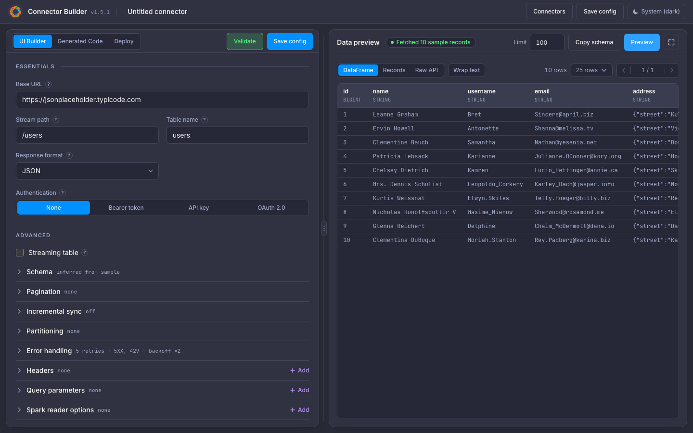

<p align="center">
  
</p>

<p align="center">
    <em>Turn any REST API into a standalone pyspark connector script — no runtime, just generated code.
</em>
</p>

<p align="center">
  <a href="https://github.com/dan1elt0m/polymo/actions/workflows/test.yml"></a>
  <a href="https://github.com/dan1elt0m/polymo/actions/workflows/gh-pages.yml"></a>
  
</p>

# Welcome to Polymo

Polymo turns a REST API into a standalone [Lakeflow Declarative Pipelines](https://docs.databricks.com/aws/en/dlt/) script. Fill out the [Builder UI](docs/builder-ui.md) form, preview real responses, and export — zero polymo runtime dependency, no config to load, nothing to import from `polymo` at all. The script only needs `requests`, the standard library, and `pyspark`.

## The builder generates standalone scripts

For example, pointing the builder at `https://jsonplaceholder.typicode.com/posts` generates the following (elided below for brevity — the real file also includes retry/backoff and response-normalization helpers):

```python
"""posts — generated by the polymo builder.

Standalone Lakeflow Declarative Pipelines source. polymo is NOT needed
at runtime; edit this file freely.
"""

BASE_URL: str = "https://jsonplaceholder.typicode.com"
PATH: str = "/posts"
PARAMS: dict[str, Any] = {"_limit": 20}

# … fetch/retry helpers elided …

# … inline Data Source (RestSource/_Reader) elided; the batch @dp.table
# below ingests through it, same as Lakeflow requires for the streaming
# variant …

spark.dataSource.register(RestSource)


@dp.table(name="posts")
def posts():
    return spark.read.format("posts_source").load()
```

See [docs/superpowers/specs/2026-08-28-codegen-pivot-design.md](docs/superpowers/specs/2026-08-28-codegen-pivot-design.md) for the full design behind this pivot.

<!-- Centered clickable screenshot -->
<p align="center">
  <a href="docs/ui.png">
    
  </a>
</p>

## How does it work?

Open the Builder UI, describe your API (base URL, path, pagination, auth,
schema — all optional except the URL and path), and preview it against the
real API. When you're happy, switch to the **Generated Code** tab and
download the script. Every field you fill in is baked into that script as a
plain Python constant or a small block of generated code — there is nothing
left to configure at runtime, and no polymo import anywhere in the output.

See the [Connector options reference](docs/config.md) for what every Builder
field generates, and the [Builder UI walkthrough](docs/builder-ui.md) for a
guided tour of the form.

## Migrating from polymo 0.x?

The YAML runtime (`spark.read.format("polymo")`, `PolymoConfig`,
`polymo smoke`) is gone in 1.0. See
[docs/migration-1.0.md](docs/migration-1.0.md) for what changed, and pin
`polymo<1.0` (0.11.0 is the last release with the old runtime) if you're not
ready to move yet.

## How to start?

```bash
pip install polymo
```

This installs everything you need, Builder UI included — FastAPI, Uvicorn,
PySpark, PyArrow, and requests all come along, so there's nothing extra to
opt into.

Note that `polymo` is never a dependency of the scripts it generates —
nothing you export needs polymo installed to run.

## Launch the builder UI

```bash
polymo
```

Or without installing it first:

```bash
uvx polymo
```

#### (Optional) Run the Builder in Docker

```bash
docker compose up --build builder
```

- The service listens on port `8000`; open <http://localhost:8000> once Uvicorn reports it is running.

## Where to Next
Read the docs [here](https://dan1elt0m.github.io/polymo/)

Other material:
- Step by step example: [medium blogpost](https://medium.com/@d.e.tom89/turn-any-rest-api-into-spark-dataframes-in-minutes-with-polymo-028a48113eb1) (written for the 0.x YAML runtime — see the [migration guide](docs/migration-1.0.md) for what changed)


## Contributing
It's still early days, but Polymo already supports a lot of features!
Is there something missing? Raise an issue or contribute!

Contributions and early feedback welcome!

---
If Polymo helped, a ⭐ makes my day
